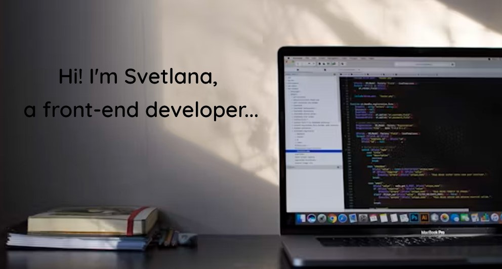

>## Contact details:
>
>### Email: swetlana.prus@gmail.com
>Prof.:
>
>
>
>
>Soc.: 
>
>

## About me:
With experience in frontend development and a higher education in IT, I specialize in building web applications using
JavaScript frameworks such as React. My projects have consistently resulted in user satisfaction. Passionate about
innovation and collaboration, effectively utilizing agile methodologies, I am eager to grow my skills further, aiming to
transition into a Full Stack Developer role.

## Qualifications / Skills:
* Javascript, React, Typescript, Redux
* jQuery, HTML, CSS, SCSS, Less, SASS, Tailwind, Bootstrap, Material UI, Webpack, Vite
* GitHub, GitLab, WebStorm, VS Code, Figma
* Microsoft Azure certifications: Fundamentals, Data Fundamentals & AI
* Soft skills: problem solving, self-awareness, time management, collaboration, adaptability, good team player

## Education:

**Kaliningrad State Technical University**\
Bachelor's degree, Engineer of Information Technologies

## Languages:

* **English**: Intermediate / Upper Intermediate
* **Norwegian**: Intermediate / Upper Intermediate

