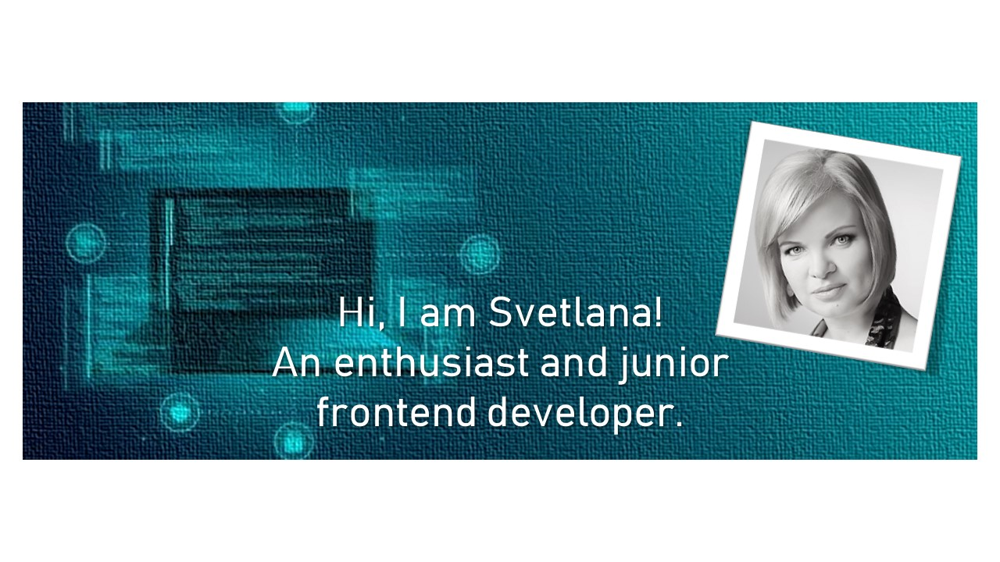

# SVETLANA PRUS


>## Contact details:
>
>### Phone: +47 97 51 42 26
>### Email: swetlana.prus@gmail.com
>Prof.:
>[](https://www.linkedin.com/in/svetlanaprus/)
>[](https://github.com/SvetlanaPrus)
>[](https://gitlab.com/SvetlanaPrus)
>[](https://www.codewars.com/users/SvetlanaPrus)
>
>Soc.: 
>[](https://t.me/SvetlanaPrus/)
>[](https://www.facebook.com/svetkulvic/)


## About me:

I have a passion and interest to new technologies. Right now, I am on a way in the career-changing transition process and looking for a job as a Frontend Developer. I have an IT-engineering background. Gained an international work experience in the maritime industry and an experience in accounting. As a person, I am structured and organized, able to prioritize and complete tasks with efficiency and accuracy. Enjoy dealing with a dynamic environment and relate to different people. Have a positive attitude and enthusiasm for new challenges. Am I your new employee?

## Skills:

1. HTML, CSS, DOM
2. Javascript
3. React, Redux
4. GitHub, GitLab
5. Webstorm, VC Code

## Code example:
[Codewars: Level 7 - Convert the score](https://www.codewars.com/kata/5b6c220fa0a661fbf200005d)
```
function scoreboard(string) {
  const arrWords = ["nil","one","two","three","four","five","six","seven","eight","nine"];
    
    return string
        .split(' ')
        .filter(word => arrWords.includes(word))
        .map(word => arrWords.indexOf(word));
}
```


## Repositories:
📌 GitHub:

[](https://github.com/SvetlanaPrus/Tips-and-Tricks-Redux)
[](https://github.com/SvetlanaPrus/Weather-Redux-API--React-hook-form-)
[](https://github.com/SvetlanaPrus/Codewars)
[](https://github.com/SvetlanaPrus/Codewars-Solutions)

📌 GitLab:
* [Billing system: Vanilla Javascript & DOM](https://gitlab.com/SvetlanaPrus/svprus-jsb-project2)
* [English Online School «Catch-up!»: Vanilla Javascript & DOM](https://gitlab.com/SvetlanaPrus/svprus-jsb-project1)

## Some achievements:
    

## Education:

**Kaliningrad State Technical University**\
Bachelor's degree, Engineer of Information Technologies

## Courses:
Learning resources: Udemy, Coursera, EdX, Pluralsight, Linkedin Learning, Microsoft documentation and webinars, bootcamps.

👉 **EdX & University of Pennsylvania** -\
09.21-present: Programming for the Web with JavaScript (Level: Intermediate)

👉 **"Lectrum", the live online bootcamp** –\
11-01.22: React, Redux, MobX, TypeScript, Styled Components and CSS Modules\
10-11.21: JavaScript/Advanced & TypeScript with modern approach to development, theory\
07-09.21: JavaScript/ECMAScript with deep topics understanding, Group & Own Projects (HTML DOM, vanilla JS & Local Storage)\
05-08.21: React, Redux, MobX, TypeScript, Styled Components and CSS Modules, Group & Own Projects (React JS)

👉 **"PASV", the live online bootcamp** –\
04-04.21: React Project, try\
12-03.21: React JS fundamentals, incl. Hooks, API, Router, Redux\
10-11.20: Javascript Practice, solving algorithmic problems\
09-10.20: Javascript Syntax

👉 **Coursera & University of London** -\
11.2020: "Responsive Web Design" course\
10.2020: "Responsive Website Basics: Code with HTML, CSS and JavaScript" course

Studied other related subjects, passed and certified:\
Microsoft Azure Data Fundamentals, Microsoft Azure Fundamentals, PRINCE2 Foundation

## Languages:

* **English**: Intermediate / Upper Intermediate
* **Norwegian**: Intermediate / Upper Intermediate
* **Lithuanian**: Beginner / Pre-Intermediate
* **Russian**: Native
